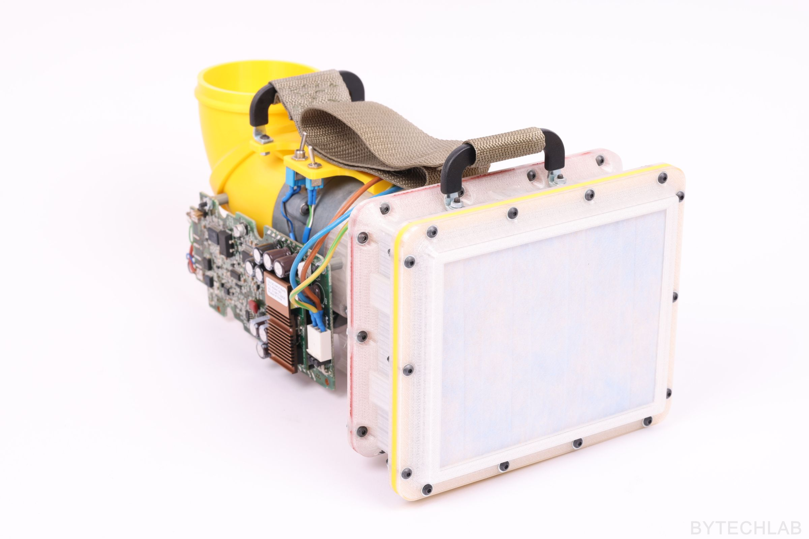

    

DIY positive pressure suit ( server fan based )

### Read more at BYTECHLAB:

<table style="width: 100%; border: none;" cellspacing="0" cellpadding="0" border="0">
  <tr>
    <td></td>
    <td>https://bytechlab.com/2020/04/covid-19-air-filtering-unit-and-pressure-suit/</td>
  </tr>
</table>

